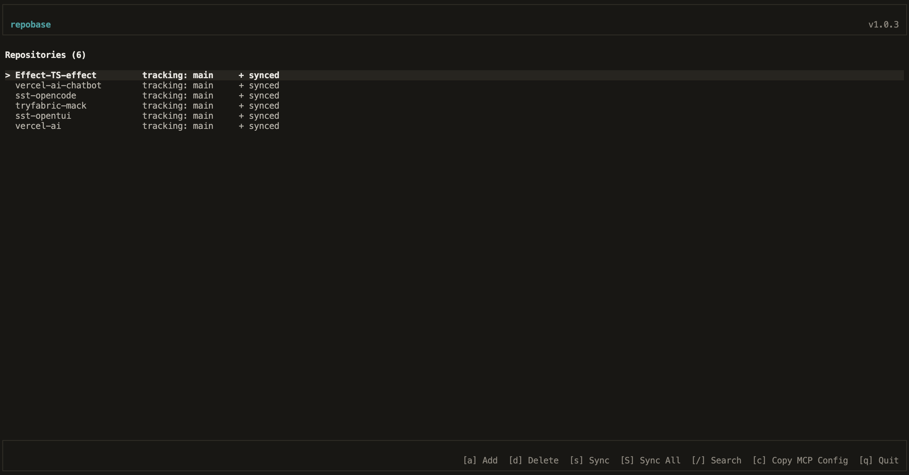

# Repobase

[](https://www.npmjs.com/package/repobase)
[](https://www.npmjs.com/package/repobase)
[](https://github.com/fernandoabolafio/repobase/actions/workflows/release.yml)
[](https://opensource.org/licenses/MIT)



Index and search your Git repositories with AI. Includes a terminal UI and MCP server for AI tool integration.

## Installation

Requires [Bun](https://bun.sh) runtime.

```bash
# Install globally
npm install -g repobase

# Or with bun
bun install -g repobase
```

## Usage

### Terminal UI

```bash
repobase
```

**Keyboard shortcuts:**

- `a` - Add repository
- `d` - Delete repository
- `s` - Sync selected repository
- `S` - Sync all repositories
- `/` - Search
- `q` - Quit

### MCP Server (Cursor, Claude, etc.)

Add to your MCP configuration (`~/.cursor/mcp.json` or Claude config):

```json
{
  "mcpServers": {
    "repobase": {
      "command": "repobase-mcp"
    }
  }
}
```

**Available tools:**

- `list_repos` - List all indexed repositories
- `search` - Search across repositories (keyword, semantic, or hybrid mode)
- `list_files` - List files in a repository
- `glob_files` - Find files by glob pattern
- `read_file` - Read file contents
- `grep` - Search file contents with regex

## Development

```bash
# Install dependencies
bun install

# Run TUI in dev mode
bun run dev:tui

# Run MCP server in dev mode
bun run dev:mcp

# Run tests
bun run test

# Build for distribution
bun run build
```

## Architecture

```
repobase/
├── packages/
│   ├── engine/      # Core library (indexing, search, git operations)
│   ├── tui/         # Terminal UI
│   └── mcp-server/  # MCP server for AI tools
└── dist/            # Built distribution (after bun run build)
```

## Contributing

This project uses [Conventional Commits](https://www.conventionalcommits.org/) for automated versioning and changelog generation.

### Commit Message Format

```
<type>(<scope>): <description>

[optional body]

[optional footer(s)]
```

**Types:**

- `feat:` - New features (triggers minor version bump)
- `fix:` - Bug fixes (triggers patch version bump)
- `perf:` - Performance improvements (triggers patch version bump)
- `refactor:` - Code refactoring (triggers patch version bump)
- `docs:` - Documentation changes (no release)
- `style:` - Code style changes (no release)
- `test:` - Test changes (no release)
- `chore:` - Maintenance tasks (no release)
- `ci:` - CI/CD changes (no release)

**Breaking Changes:**

Add `BREAKING CHANGE:` in the commit footer or `!` after the type to trigger a major version bump:

```
feat!: remove deprecated API

BREAKING CHANGE: The old API has been removed.
```

### Release Process

1. **Merges to `main`** automatically publish a release candidate to npm with the `@next` tag
2. **Manual trigger** of the "Promote to Latest" workflow publishes to `@latest` and creates a GitHub release

## License

MIT
